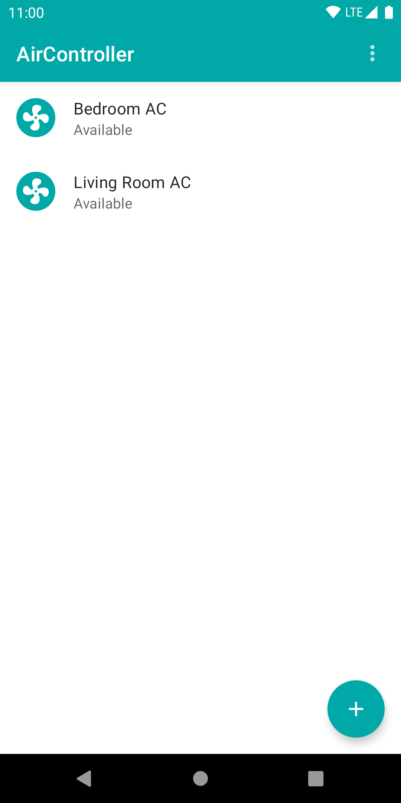
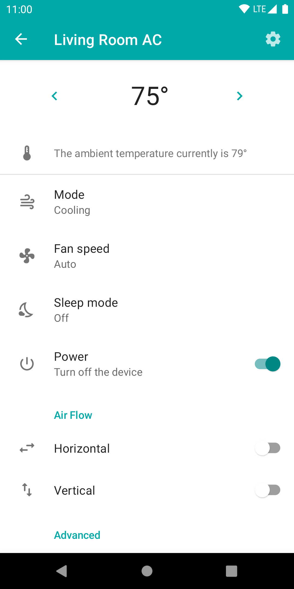
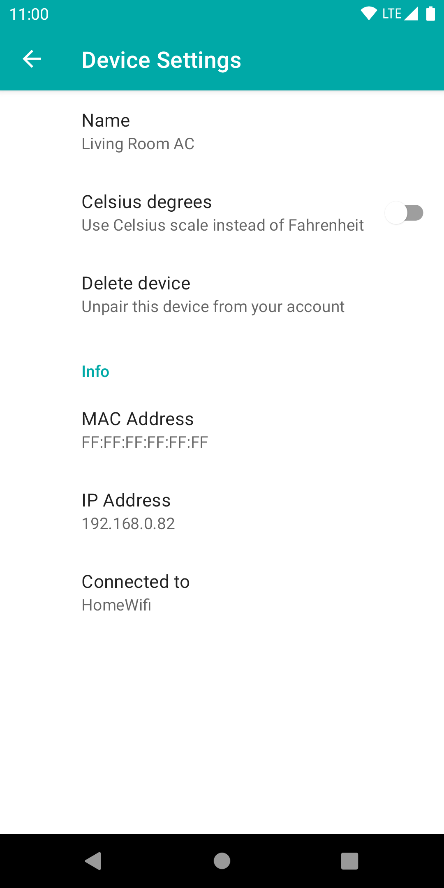

# AirController for Hisense

An open source alternative to [Hi-Smart AC (EU)](https://play.google.com/store/apps/details?id=com.accontrol.europe.hisense) and [HiSmart Air (US)](https://play.google.com/store/apps/details?id=com.aylanetworks.accontrol.hisense).

### Instructions

Make sure your air conditioner is supposed to work with the previously mentioned official applications and login into AirController.\
You have to be registered throught the official application in order to login.

### Demo mode

If you are just curious about what the app looks like you can login with the account demo@example.com and navigate through all the features.

### Screenshots

  

## Development and Techical details

The UI is entirely written in [Jetpack Compose](https://developer.android.com/jetpack/compose) and uses [Koin](https://insert-koin.io/) for dependency injection.

### Modules

Modules are organized as it follows:\
app: The main application\
common: Common objects required by app and providers\
provider-base: Interfaces that need to be implemented by each provider\
provider-demo: Demo provider implementation\
provider-ayla: Ayla provider implementation

<!-- ### Device control

Each feature might be available or not according to the state of the device. For this reason when the device state is requested the view model and the repository do not talk directly to each other but the raw state is filtered through feature controllers which the provider must implement for every available feature. Then each controller, which is responsible for a single feature, will report to the viewmodel ethier the value retrieved by the repository or null in case the feature is not available or should be hidden (eg. for the given work mode). -->
